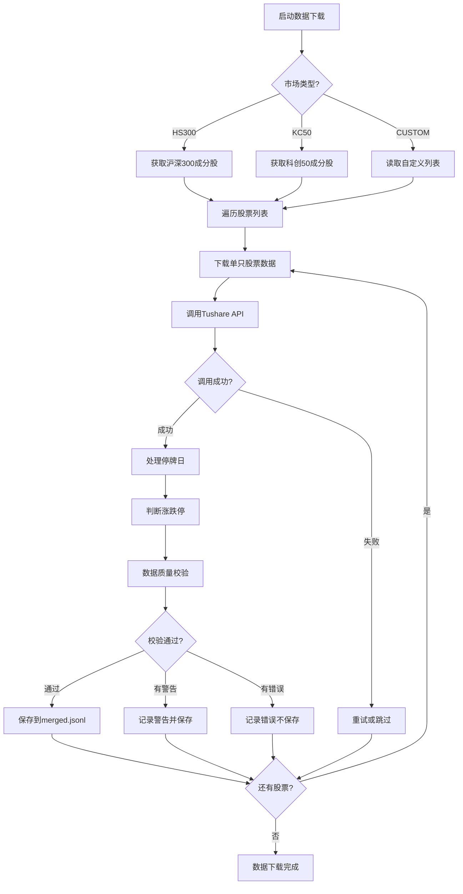
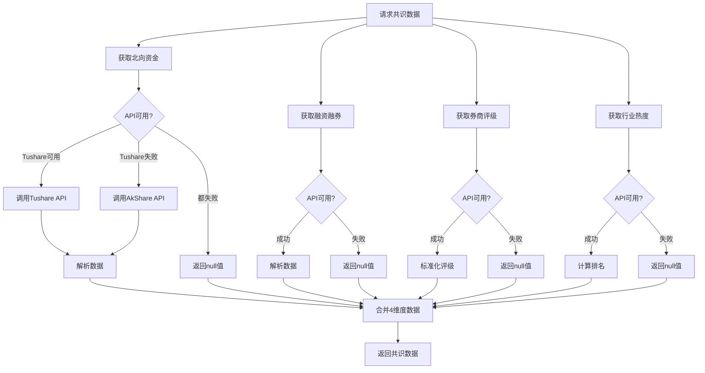
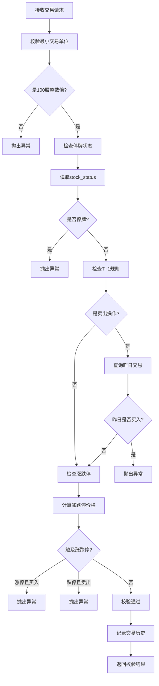

# TODO项完成设计文档

## 设计目标

完成AI-Trader项目中所有标记为TODO的功能实现，确保系统达到可运行状态，支持A股市场的完整回测和实盘交易。

## 范围界定

本设计涵盖以下TODO项的完成方案：

### 高优先级（阻塞系统运行）
1. 数据获取模块 - `data/get_astock_data.py` 中的5个TODO函数
2. 共识数据模块 - `data/get_consensus_data.py` 中的8个TODO函数
3. 交易校验模块 - `agent_tools/tool_trade_astock.py` 中的2个TODO函数

### 中优先级（影响功能完整性）
4. 共识筛选模块 - `agent_tools/tool_consensus_filter.py` 中的4个TODO优化项
5. 回测代理模块 - `agent/backtest_agent.py` 和 `agent/base_agent/backtest_agent.py` 中的2个TODO项
6. MCP工具适配 - `agent_tools/tool_get_consensus.py` 中的装饰器适配

### 低优先级（优化项）
7. 代码注释优化和文档完善

## 前置条件

### 必需的环境变量
需要在 `.env` 文件中配置以下API密钥：
- `TUSHARE_TOKEN` - Tushare Pro API Token（用于A股数据获取）
- `OPENAI_API_KEY` - OpenAI API密钥
- `OPENAI_API_BASE` - OpenAI API基础URL
- `JINA_API_KEY` - Jina搜索API密钥（可选）

### 依赖包安装
需要安装以下Python包：
- `tushare` - A股数据源主要提供者
- `akshare` - A股数据源备用提供者
- `pandas` - 数据处理

## 详细设计方案

### 阶段1：数据获取模块完成（高优先级）

#### 1.1 股票列表获取功能 - `fetch_stock_list()`

**需求说明**

实现从Tushare获取沪深300、科创50、全市场股票列表的功能，并识别ST股票。

**设计方案**

| 实现步骤 | 说明 |
|---------|------|
| API调用 | 使用 `pro.index_weight()` 获取指数成分股 |
| 市场筛选 | 根据market参数筛选HS300、KC50或全部股票 |
| ST识别 | 调用 `identify_st_stock()` 判断ST股票 |
| 数据整合 | 获取股票的行业、上市日期、交易状态等信息 |
| 持久化 | 保存到 `data/astock_list.json` |

**输出数据结构**

```
{
  "update_time": "2024-01-15 15:00:00",
  "total_count": 300,
  "market": "HS300",
  "stocks": [
    {
      "symbol": "600519.SH",
      "name": "贵州茅台",
      "industry": "白酒",
      "market": "主板",
      "list_date": "2001-08-27",
      "is_st": false,
      "status": "normal"
    }
  ]
}
```

**API调用方案**

| 市场类型 | Tushare API | 参数 |
|---------|-------------|------|
| 沪深300 | `pro.index_weight()` | index_code='000300.SH' |
| 科创50 | `pro.index_weight()` | index_code='000688.SH' |
| 全市场 | `pro.stock_basic()` | exchange='SSE,SZSE', list_status='L' |

**数据质量控制**

- 过滤已退市股票（status != 'D'）
- 验证股票代码格式（6位数字+后缀）
- 验证上市日期合法性
- 处理API返回空值情况

#### 1.2 历史数据下载功能 - `fetch_daily_data()`

**需求说明**

下载指定股票的历史日线数据，处理停牌日，判断涨跌停状态。

**设计方案**

| 实现步骤 | 说明 |
|---------|------|
| 获取日线数据 | 使用 `pro.daily()` 获取未复权数据，使用 `ts.pro_bar()` 获取复权数据 |
| 获取停牌信息 | 使用 `pro.suspend_d()` 获取停牌记录 |
| 停牌日处理 | 使用前收盘价填充停牌日数据，标记status='suspended' |
| 涨跌停判断 | 计算涨跌停价格（精确到分），比较当前价格是否触及涨跌停 |
| 数据验证 | 检查价格连续性、成交量合理性 |

**停牌日处理逻辑**

```
流程：
1. 获取指定日期范围的交易日历
2. 获取股票实际有交易数据的日期
3. 识别缺失日期（交易日 - 实际交易日 = 停牌日）
4. 对停牌日填充数据：
   - open = close = high = low = 前收盘价
   - volume = 0
   - amount = 0
   - status = "suspended"
   - suspend_reason = 从停牌公告获取（可选）
```

**涨跌停状态判断**

| 股票类型 | 涨跌幅限制 | 判断条件 |
|---------|-----------|---------|
| 主板普通股 | ±10% | abs(close - limit_price) < 0.01 |
| ST股票 | ±5% | abs(close - limit_price) < 0.01 |
| 科创板 | ±20% | abs(close - limit_price) < 0.01 |
| 创业板 | ±20% | abs(close - limit_price) < 0.01 |

**输出数据结构**

```
[
  {
    "symbol": "600519.SH",
    "date": "2024-01-15",
    "open": 1860.00,
    "close": 1880.00,
    "high": 1890.00,
    "low": 1855.00,
    "volume": 12345678,
    "amount": 231234567.89,
    "prev_close": 1850.00,
    "change_pct": 1.62,
    "status": "normal",
    "is_limit_up": false,
    "is_limit_down": false,
    "suspend_reason": null
  }
]
```

#### 1.3 数据质量校验功能 - `validate_data_quality()`

**需求说明**

对下载的数据进行质量检查，发现异常数据并给出警告。

**设计方案**

| 校验维度 | 规则 | 处理方式 |
|---------|------|---------|
| 价格连续性 | 涨跌幅绝对值 < 50%（非停牌复牌日） | 超出记warning |
| 价格合理性 | open/high/low/close > 0 | 不合法记error |
| OHLC关系 | high >= max(open,close), low <= min(open,close) | 不合法记error |
| 成交量合理性 | 非停牌日volume > 0 | volume=0记warning |
| 时间序列 | 日期递增，无重复 | 重复或倒序记error |
| 字段完整性 | 所有必需字段非空 | 缺失记error |

**校验流程**

```
对于数据列表中的每条记录：
1. 检查必需字段是否存在
2. 检查OHLC价格关系是否合理
3. 检查成交量与状态是否匹配
4. 如果有前一日数据，检查价格连续性
5. 收集所有warnings和errors

返回：
- valid: 是否通过校验（无error）
- warnings: 警告列表
- errors: 错误列表
```

### 阶段2：共识数据模块完成（高优先级）

#### 2.1 北向资金数据获取

**需求说明**

通过Tushare或AkShare获取北向资金（沪深股通）的买入、卖出、净额数据。

**设计方案 - Tushare优先**

| 实现步骤 | API接口 | 说明 |
|---------|---------|------|
| 获取持股数据 | `pro.hk_hold()` | 获取北向资金持股变化 |
| 计算净流入 | 根据持股变化计算 | net_amount = 当日持股市值变化 |
| 数据转换 | 转换为标准格式 | 金额单位统一为万元 |

**设计方案 - AkShare备用**

| 实现步骤 | API接口 | 说明 |
|---------|---------|------|
| 获取个股数据 | `ak.stock_hsgt_individual_em()` | 获取个股北向资金流向 |
| 筛选日期 | 根据date参数过滤 | 返回指定日期数据 |

**数据缺失处理**

遵循D3修复原则：
- API调用失败 → 返回null值，不抛出异常
- 指定日期无数据 → 返回null值
- 数据源切换逻辑 → Tushare失败后尝试AkShare

#### 2.2 融资融券数据获取

**需求说明**

获取股票的融资余额、融券余额、融资买入额等数据。

**设计方案 - Tushare优先**

| 实现步骤 | API接口 | 说明 |
|---------|---------|------|
| 获取融资融券明细 | `pro.margin_detail()` | 获取个股融资融券数据 |
| 提取字段 | 从DataFrame提取 | margin_balance, short_balance, margin_buy_amount |
| 单位转换 | 转换为万元 | 原始数据可能是元 |

**设计方案 - AkShare备用**

| 实现步骤 | API接口 | 说明 |
|---------|---------|------|
| 获取明细数据 | `ak.stock_margin_detail_em()` | 东方财富融资融券数据 |
| 筛选日期 | 根据date参数过滤 | 返回指定日期数据 |

**数据增强计算**

为支持共识评分，需要计算环比增长率：
- 需要查询前一交易日的融资余额
- 计算 `margin_balance_change_pct = (今日余额 - 昨日余额) / 昨日余额 × 100`
- 如果无历史数据，该字段返回null

#### 2.3 券商评级数据获取

**需求说明**

获取分析师对股票的评级、目标价、评级变化等信息。

**设计方案 - Tushare优先**

| 实现步骤 | API接口 | 说明 |
|---------|---------|------|
| 获取评级数据 | `pro.stk_rating()` | 获取券商评级记录 |
| 筛选最新评级 | 按发布日期排序 | 获取指定日期前最新的评级 |
| 统计机构数量 | 统计最近30天评级数 | institution_count字段 |
| 判断评级变化 | 对比前次评级 | 上调/维持/下调/首次 |

**评级标准化映射**

| 原始评级 | 标准化评级 | 分数权重 |
|---------|-----------|---------|
| 买入、强烈推荐、推荐 | 买入 | +10分 |
| 增持、优于大市 | 增持 | +5分 |
| 中性、持有 | 中性 | 0分 |
| 减持、弱于大市 | 减持 | -5分 |
| 卖出 | 卖出 | -10分 |

**设计方案 - AkShare备用**

| 实现步骤 | API接口 | 说明 |
|---------|---------|------|
| 获取评级汇总 | `ak.stock_rating_all()` | 获取所有股票评级 |
| 筛选股票和日期 | 根据symbol和date过滤 | 返回匹配数据 |

#### 2.4 行业热度数据获取

**需求说明**

获取行业当日涨跌幅、资金流向、热度排名等数据。

**设计方案 - Tushare优先**

| 实现步骤 | API接口 | 说明 |
|---------|---------|------|
| 获取行业指数 | `pro.ths_index()` | 同花顺行业指数 |
| 获取行业成分 | `pro.ths_member()` | 确认股票所属行业 |
| 计算资金流向 | 聚合个股资金流 | 可选，数据量大 |

**行业分类映射**

| 标准行业名称 | Tushare指数代码 | 说明 |
|------------|----------------|------|
| 银行 | 885716.TI | 同花顺银行指数 |
| 医药 | 885530.TI | 同花顺医药指数 |
| 半导体 | 884186.TI | 同花顺半导体指数 |
| 白酒 | 885590.TI | 同花顺白酒指数 |
| ... | ... | 需要建立完整映射表 |

**设计方案 - AkShare备用**

| 实现步骤 | API接口 | 说明 |
|---------|---------|------|
| 获取行业板块 | `ak.stock_board_industry_name_em()` | 东方财富行业分类 |
| 获取行业数据 | `ak.stock_board_industry_hist_em()` | 行业历史数据 |
| 筛选日期 | 根据date参数过滤 | 返回指定日期数据 |

**热度排名计算**

```
计算逻辑：
1. 获取所有行业当日涨跌幅
2. 按涨跌幅降序排序
3. 返回目标行业的排名（1 = 最热）

如果数据源未提供排名：
- 自行计算并缓存
- 热度排名 = 涨幅排序位置
```

### 阶段3：交易校验模块完成（高优先级）

#### 3.1 停牌状态读取 - `_get_stock_status()`

**需求说明**

从数据文件 `merged_data.jsonl` 读取指定日期的股票状态（normal/suspended）。

**设计方案**

| 实现步骤 | 说明 |
|---------|------|
| 文件读取 | 读取 `data/merged_data.jsonl` 或 `data/merged_data_{symbol}.jsonl` |
| 日期匹配 | 查找匹配 symbol 和 date 的记录 |
| 状态提取 | 返回 status 字段，默认值为 "normal" |
| 缓存优化 | 对同一日期的多次查询使用缓存 |

**数据来源**

从 `fetch_daily_data()` 生成的数据中读取，该函数已标记停牌状态。

**容错处理**

- 文件不存在 → 返回 "normal"（假定正常交易）
- 日期不存在 → 返回 "normal"（假定该日无交易，非停牌）
- status字段缺失 → 返回 "normal"

#### 3.2 历史交易记录读取（支持T+1校验）

**需求说明**

完善 `check_t1_rule()` 的历史交易查询逻辑。

**设计方案**

当前实现使用内存字典 `trading_history`，需要增强：

| 功能 | 实现方式 |
|------|---------|
| 持久化存储 | 将交易历史保存到 `data/trade_history.json` |
| 交易记录 | 每次调用 `record_trade()` 时追加记录 |
| 查询优化 | 只加载最近2天的交易记录到内存 |
| 回测支持 | 回测时从模拟交易记录读取 |

**数据结构**

```
{
  "2024-01-15": {
    "600000.SH": {
      "action": "buy",
      "quantity": 100,
      "price": 10.50,
      "timestamp": "2024-01-15 09:35:00"
    }
  }
}
```

### 阶段4：共识筛选优化（中优先级）

#### 4.1 融资余额环比计算

**需求说明**

在 `calculate_capital_score()` 中计算融资余额的环比增长率。

**设计方案**

| 实现步骤 | 说明 |
|---------|------|
| 查询历史数据 | 从共识数据中查询前一交易日的融资余额 |
| 计算增长率 | (今日 - 昨日) / 昨日 × 100 |
| 缓存优化 | 缓存前一日数据，避免重复查询 |
| 异常处理 | 无历史数据时，该维度记0分 |

**实现位置**

在 `tool_consensus_filter.py` 第185行附近，替换TODO注释。

#### 4.2 主力资金数据源对接

**需求说明**

获取主力资金净流入数据，用于资金面评分。

**设计方案**

| 数据源 | API接口 | 说明 |
|--------|---------|------|
| Tushare | `pro.moneyflow_hsgt()` | 沪深港通资金流向 |
| AkShare | `ak.stock_individual_fund_flow()` | 个股资金流向 |

**集成方式**

将主力资金数据集成到 `get_consensus_data.py` 的 `fetch_all_consensus_data()` 中，作为新的维度返回。

#### 4.3 行业涨跌幅对比

**需求说明**

在 `calculate_logic_score()` 中对比行业涨跌幅与大盘涨跌幅。

**设计方案**

| 实现步骤 | 说明 |
|---------|------|
| 获取大盘数据 | 使用 `pro.index_daily()` 获取上证指数/深证成指 |
| 计算相对涨幅 | 行业涨幅 - 大盘涨幅 |
| 评分逻辑 | 相对涨幅 > 2% → +10分，< -2% → -10分 |

**大盘指数选择**

- 沪市股票 → 对比上证指数（000001.SH）
- 深市股票 → 对比深证成指（399001.SZ）

#### 4.4 社交媒体和搜索数据对接

**需求说明**

在 `calculate_sentiment_score()` 中对接社交媒体热度和搜索指数API。

**设计方案**

| 数据源 | 实现方式 | 说明 |
|--------|---------|------|
| 社交媒体热度 | AkShare `ak.stock_hot_rank_em()` | 东方财富人气榜 |
| 搜索指数 | AkShare `ak.baidu_search_index()` | 百度搜索指数（需要账号） |

**降级方案**

如果外部API不可用：
- 该维度记0分
- 不影响其他维度计算
- 在返回结果中标记 `missing_fields`

### 阶段5：回测代理优化（中优先级）

#### 5.1 BaseAgent导入修复

**需求说明**

修复 `agent/backtest_agent.py` 第24行的TODO，正确导入BaseAgent基类。

**设计方案**

根据项目结构，BaseAgent位于 `agent/base_agent/base_agent.py`：

```
修改：
from agent.base_agent.base_agent import BaseAgent

然后让 BacktestAgent 继承 BaseAgent：
class BacktestAgent(BaseAgent):
    ...
```

**继承注意事项**

- 覆写 `run_trading_session()` 方法
- 保留 `__init__()` 的扩展参数
- 调用 `super().__init__()` 初始化父类

#### 5.2 本地工具函数实现

**需求说明**

在 `agent/base_agent/backtest_agent.py` 第124行，实现本地工具函数模拟MCP工具。

**设计方案**

创建本地工具函数，替代MCP工具调用：

| 工具名称 | 实现方式 |
|---------|---------|
| get_price | 调用 `get_price_local()` 从缓存读取 |
| trade | 调用回测引擎的交易模拟 |
| get_consensus | 调用 `get_consensus_local()` 从缓存读取 |
| search | 返回模拟新闻数据或使用本地索引 |

**工具封装**

```
工具列表结构：
[
  {
    "name": "get_price",
    "description": "获取股票价格",
    "function": get_price_local,
    "parameters": {...}
  },
  ...
]
```

### 阶段6：MCP工具适配（中优先级）

#### 6.1 MCP装饰器适配

**需求说明**

替换 `agent_tools/tool_get_consensus.py` 第29行的模拟装饰器为实际MCP框架装饰器。

**设计方案**

根据项目使用的MCP框架版本：

**如果使用标准MCP协议：**
```
从MCP SDK导入：
from mcp.server import tool

替换模拟装饰器：
@tool()
def get_northbound_flow(...):
    ...
```

**如果使用自定义MCP封装：**
```
从项目MCP模块导入：
from agent_tools.mcp_wrapper import mcp_tool

应用装饰器：
@mcp_tool(
    name="get_northbound_flow",
    description="获取北向资金流向"
)
def get_northbound_flow(...):
    ...
```

**验证方式**

- 工具能被Agent发现并调用
- 参数验证正常工作
- 返回值格式符合MCP规范

## 数据流设计

### 数据获取流程



### 共识数据获取流程



### 交易校验流程



## 数据模型设计

### 股票列表数据模型

| 字段名 | 类型 | 必需 | 说明 |
|--------|------|------|------|
| symbol | string | 是 | 股票代码（含后缀） |
| name | string | 是 | 股票名称 |
| industry | string | 否 | 所属行业 |
| market | string | 是 | 市场类型（主板/科创板/创业板） |
| list_date | string | 是 | 上市日期 YYYY-MM-DD |
| is_st | boolean | 是 | 是否为ST股票 |
| status | string | 是 | 交易状态（normal/suspended/delisted） |

### 行情数据模型

| 字段名 | 类型 | 必需 | 说明 |
|--------|------|------|------|
| symbol | string | 是 | 股票代码 |
| date | string | 是 | 交易日期 YYYY-MM-DD |
| open | float | 是 | 开盘价 |
| close | float | 是 | 收盘价 |
| high | float | 是 | 最高价 |
| low | float | 是 | 最低价 |
| volume | integer | 是 | 成交量 |
| amount | float | 是 | 成交额 |
| prev_close | float | 是 | 前收盘价 |
| change_pct | float | 是 | 涨跌幅% |
| status | string | 是 | 状态（normal/suspended/limit_up/limit_down） |
| is_limit_up | boolean | 是 | 是否涨停 |
| is_limit_down | boolean | 是 | 是否跌停 |
| suspend_reason | string | 否 | 停牌原因 |

### 共识数据模型

| 维度 | 字段名 | 类型 | 必需 | 说明 |
|------|--------|------|------|------|
| 北向资金 | buy_amount | float | 否 | 买入金额（万元） |
| 北向资金 | sell_amount | float | 否 | 卖出金额（万元） |
| 北向资金 | net_amount | float | 否 | 净流入（万元） |
| 融资融券 | margin_balance | float | 否 | 融资余额（万元） |
| 融资融券 | short_balance | float | 否 | 融券余额（万元） |
| 融资融券 | margin_buy_amount | float | 否 | 融资买入额（万元） |
| 融资融券 | margin_balance_change_pct | float | 否 | 融资余额环比% |
| 券商评级 | rating | string | 否 | 评级（买入/增持/中性/减持/卖出） |
| 券商评级 | target_price | float | 否 | 目标价（元） |
| 券商评级 | rating_change | string | 否 | 评级变化（上调/维持/下调） |
| 券商评级 | institution_count | integer | 否 | 评级机构数 |
| 行业热度 | pct_change | float | 否 | 行业涨跌幅% |
| 行业热度 | net_flow | float | 否 | 行业资金净流入（万元） |
| 行业热度 | heat_rank | integer | 否 | 热度排名 |
| 元信息 | data_source | string | 是 | 数据来源（tushare/akshare/error） |
| 元信息 | error | string | 否 | 错误信息 |

## 异常处理策略

### API调用异常

| 异常类型 | 处理策略 | 用户反馈 |
|---------|---------|---------|
| 网络超时 | 重试3次，每次间隔5秒 | 记录warning日志 |
| API限流 | 等待60秒后重试 | 记录info日志 |
| Token无效 | 切换备用数据源 | 记录error日志 |
| 数据不存在 | 返回null值 | 不记录日志 |
| 积分不足 | 切换备用数据源 | 记录warning日志 |

### 数据质量异常

| 异常情况 | 处理策略 | 影响范围 |
|---------|---------|---------|
| 价格异常波动 | 保留数据，标记warning | 不影响使用 |
| 字段缺失 | 返回null值 | 不影响其他字段 |
| 日期格式错误 | 跳过该记录 | 仅影响单条记录 |
| 数据重复 | 保留最新记录 | 去重处理 |

### 交易校验异常

| 违规类型 | 异常类 | 处理方式 |
|---------|--------|---------|
| T+1违规 | TradeViolationError | 拒绝交易，返回明确错误信息 |
| 涨跌停违规 | TradeViolationError | 拒绝交易，返回明确错误信息 |
| 交易单位违规 | TradeViolationError | 拒绝交易，返回明确错误信息 |
| 停牌违规 | TradeViolationError | 拒绝交易，返回明确错误信息 |

## 性能优化策略

### 数据缓存机制

| 缓存对象 | 缓存策略 | 失效条件 |
|---------|---------|---------|
| 股票列表 | 启动时加载到内存 | 手动刷新 |
| 行情数据 | 按股票分片加载 | 无失效（历史数据） |
| 共识数据 | 按日期索引缓存 | 无失效（历史数据） |
| 交易历史 | 保留最近2天 | 超过2天清理 |

### API调用优化

| 优化项 | 策略 | 效果 |
|--------|------|------|
| 批量查询 | 使用API的批量接口 | 减少调用次数10倍 |
| 限流控制 | 每次调用间隔0.5秒 | 避免触发限流 |
| 数据预加载 | 回测开始前加载全部数据 | 消除运行时IO |
| 并发控制 | 最多5个并发请求 | 平衡速度和限流 |

### 文件IO优化

| 优化项 | 策略 | 效果 |
|--------|------|------|
| 批量写入 | 累积100条记录后写入 | 减少磁盘IO |
| 分片存储 | 按股票代码分文件存储 | 加速查询 |
| 索引建立 | 建立日期索引 | 快速定位记录 |

## 测试验证方案

### 单元测试覆盖

| 模块 | 测试用例 | 验证内容 |
|------|---------|---------|
| get_astock_data | UT-DA-001~005 | 股票列表获取、数据下载、停牌处理 |
| get_consensus_data | UT-CD-001~008 | 4维度数据获取、缺失处理 |
| tool_trade_astock | UT-TR-001~009 | 交易规则校验 |
| tool_consensus_filter | UT-CS-001~005 | 共识分数计算 |

### 集成测试覆盖

| 测试场景 | 验证内容 |
|---------|---------|
| IT-TF-001 | 完整交易流程（获取数据→分析→交易→校验） |
| IT-TF-002 | 数据源切换（Tushare失败→AkShare备用） |
| IT-CF-001 | 共识筛选流程（获取数据→计算分数→筛选排序） |

### 回测测试覆盖

| 测试场景 | 验证内容 |
|---------|---------|
| BT-ACC-001 | 时间旅行检测（禁止访问未来数据） |
| BT-ACC-002 | T+1规则执行（当日买入次日卖出） |
| BT-DATA-001 | 停牌日处理（停牌日无法交易） |
| BT-DATA-002 | 涨跌停处理（涨停禁买、跌停禁卖） |

### 边界测试覆盖

| 边界情况 | 验证内容 |
|---------|---------|
| EDGE-001 | 空数据处理（股票列表为空） |
| EDGE-002 | 全缺失数据（所有维度返回null） |
| EDGE-003 | 极端价格（涨停价计算精度） |
| EDGE-004 | 大量并发（100只股票同时下载） |

## 实施计划

### 阶段1：数据获取核心功能（2天）

| 任务 | 工作量 | 优先级 |
|------|--------|--------|
| 实现 fetch_stock_list() | 4小时 | P0 |
| 实现 fetch_daily_data() | 6小时 | P0 |
| 实现 validate_data_quality() | 2小时 | P0 |
| 单元测试 UT-DA系列 | 4小时 | P0 |

### 阶段2：共识数据获取（2天）

| 任务 | 工作量 | 优先级 |
|------|--------|--------|
| 实现北向资金获取（Tushare+AkShare） | 3小时 | P0 |
| 实现融资融券获取 | 3小时 | P0 |
| 实现券商评级获取 | 4小时 | P0 |
| 实现行业热度获取 | 3小时 | P0 |
| 单元测试 UT-CD系列 | 3小时 | P0 |

### 阶段3：交易校验完善（0.5天）

| 任务 | 工作量 | 优先级 |
|------|--------|--------|
| 实现 _get_stock_status() | 1小时 | P0 |
| 增强交易历史持久化 | 2小时 | P1 |
| 单元测试 UT-TR补充 | 1小时 | P0 |

### 阶段4：共识筛选优化（1天）

| 任务 | 工作量 | 优先级 |
|------|--------|--------|
| 融资余额环比计算 | 2小时 | P1 |
| 主力资金数据对接 | 3小时 | P1 |
| 行业涨跌幅对比 | 2小时 | P1 |
| 社交媒体数据对接（可选） | 1小时 | P2 |

### 阶段5：回测代理完善（0.5天）

| 任务 | 工作量 | 优先级 |
|------|--------|--------|
| BaseAgent导入修复 | 0.5小时 | P1 |
| 本地工具函数实现 | 3小时 | P1 |

### 阶段6：MCP工具适配（0.5天）

| 任务 | 工作量 | 优先级 |
|------|--------|--------|
| MCP装饰器替换 | 1小时 | P1 |
| 工具注册验证 | 2小时 | P1 |

### 阶段7：集成测试与验证（1天）

| 任务 | 工作量 | 优先级 |
|------|--------|--------|
| 生成真实测试数据 | 2小时 | P0 |
| 执行集成测试 | 3小时 | P0 |
| 执行回测测试 | 2小时 | P0 |
| 修复发现的问题 | 1小时 | P0 |

### 总工作量估算

- **高优先级（P0）任务**：5天
- **中优先级（P1）任务**：1.5天
- **低优先级（P2）任务**：0.5天
- **总计**：7个工作日

## 风险评估

### 技术风险

| 风险项 | 影响 | 概率 | 缓解措施 |
|--------|------|------|---------|
| Tushare API积分不足 | 高 | 中 | 使用AkShare备用数据源 |
| API频率限制 | 中 | 高 | 增加调用间隔，实现指数退避 |
| 历史数据质量问题 | 中 | 中 | 严格的数据质量校验 |
| 停牌数据缺失 | 低 | 低 | 使用前收盘价填充 |

### 业务风险

| 风险项 | 影响 | 概率 | 缓解措施 |
|--------|------|------|---------|
| 共识数据维度缺失 | 中 | 高 | 缺失维度记0分，不影响其他维度 |
| 评级标准不统一 | 低 | 中 | 建立评级映射表标准化 |
| 行业分类不一致 | 低 | 中 | 建立行业映射表 |

### 性能风险

| 风险项 | 影响 | 概率 | 缓解措施 |
|--------|------|------|---------|
| 数据下载时间过长 | 中 | 高 | 支持增量下载、断点续传 |
| 内存占用过大 | 中 | 中 | 分片加载、按需缓存 |
| 文件IO成为瓶颈 | 低 | 低 | 批量写入、建立索引 |

## 验收标准

### 功能验收

| 验收项 | 标准 |
|--------|------|
| 股票列表获取 | 能成功获取沪深300、科创50、全市场股票列表 |
| 历史数据下载 | 能下载指定日期范围的日线数据，正确处理停牌日 |
| 共识数据获取 | 4维度数据能正确获取，缺失时返回null |
| 交易规则校验 | T+1、涨跌停、停牌、交易单位规则正确执行 |
| 共识分数计算 | 4维度分数计算正确，总分0-100范围 |
| 回测功能 | 能执行完整回测，时间旅行检测有效 |

### 性能验收

| 验收项 | 标准 |
|--------|------|
| 数据下载速度 | 300只股票1年数据在30分钟内完成 |
| 内存占用 | 加载300只股票1年数据内存占用 < 2GB |
| 回测速度 | 单日回测决策完成时间 < 60秒 |
| API调用频率 | 符合Tushare限流要求（120次/分钟） |

### 质量验收

| 验收项 | 标准 |
|--------|------|
| 单元测试覆盖率 | 核心功能覆盖率 > 90% |
| 集成测试通过率 | 所有集成测试用例通过 |
| 边界测试通过率 | 所有边界测试用例通过 |
| 代码质量 | 无pylint错误，warning < 10个 |

### 文档验收

| 验收项 | 标准 |
|--------|------|
| 函数文档字符串 | 所有公共函数有完整的文档字符串 |
| API使用示例 | 每个模块末尾有可运行的示例代码 |
| 错误处理说明 | 所有异常情况有说明文档 |

## 置信度评估

**整体置信度：高（85%）**

### 置信度依据

| 影响因素 | 置信度影响 | 说明 |
|---------|-----------|------|
| 需求清晰度 | +15% | TODO项明确，需求文档完整 |
| 代码框架完整性 | +20% | 70%框架已完成，仅需填充实现 |
| API可用性 | -10% | Tushare需要积分，但有AkShare备用 |
| 技术栈熟悉度 | +10% | 使用标准Python库，无新技术引入 |
| 测试覆盖设计 | +15% | 40个测试用例已设计好 |
| 时间充足性 | +10% | 7天工作量合理 |
| 依赖风险 | -5% | 依赖外部API，可能有限流风险 |

### 关键成功因素

1. **Tushare API积分充足**：如果积分不足，需依赖AkShare备用数据源
2. **网络稳定性**：数据下载需要稳定的网络连接
3. **数据质量**：历史数据质量影响回测准确性
4. **测试充分性**：充分的测试能尽早发现问题

### 潜在障碍

1. **API限流**：高频调用可能触发限流，需要增加延迟
2. **数据缺失**：部分股票或日期可能没有共识数据
3. **性能问题**：大量数据加载可能导致内存或IO瓶颈2. **数据缺失**：部分股票或日期可能没有共识数据
