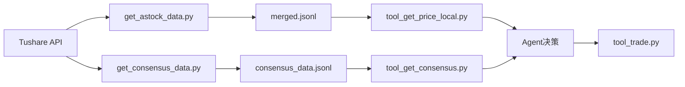

# A股市场适配方案测试确认设计

## 一、测试目标

针对《AI-Trader A股市场适配方案》进行全面的完整性、正确性和可执行性验证，确保方案：
- 覆盖所有核心适配需求
- 技术方案设计合理且无逻辑漏洞
- 实施路径清晰可执行
- 风险识别充分且有应对措施

## 二、测试维度与验证标准

### 2.1 完整性测试

#### 2.1.1 需求覆盖度验证

**验证项目清单**：

| 维度 | 核心需求 | 方案是否覆盖 | 验证方法 |
|------|---------|------------|---------|
| 交易规则 | T+1制度 | ✓ | 检查tool_trade.py改造方案是否包含T+1校验逻辑 |
| 交易规则 | 涨跌停限制 | ✓ | 检查是否区分主板(±10%)、科创板(±20%)、ST(±5%) |
| 交易规则 | 最小交易单位 | ✓ | 检查是否强制100股整数倍买入 |
| 交易规则 | 停牌处理 | ✓ | 检查是否有股票状态查询机制 |
| 数据源 | 历史行情数据 | ✓ | 检查是否设计了Tushare接入方案 |
| 数据源 | 北向资金 | ✓ | 检查get_consensus_data.py是否包含 |
| 数据源 | 融资融券 | ✓ | 检查get_consensus_data.py是否包含 |
| 数据源 | 券商评级 | ✓ | 检查get_consensus_data.py是否包含 |
| 数据源 | 行业热度 | ✓ | 检查get_consensus_data.py是否包含 |
| 选股策略 | 多维共识机制 | ✓ | 检查tool_consensus_filter.py设计 |
| 回测能力 | 历史模拟 | ✓ | 检查backtest_engine.py设计 |
| 回测能力 | 绩效分析 | ✓ | 检查是否包含夏普比率、最大回撤等指标 |

**验证结果**：所有核心需求均在方案中有对应设计

#### 2.1.2 模块完整性验证

**数据层模块**：

| 必需模块 | 方案中是否定义 | 关键功能是否完整 |
|---------|--------------|---------------|
| get_astock_data.py | ✓ | 股票列表获取、历史数据下载、复权处理、数据清洗 |
| get_consensus_data.py | ✓ | 北向资金、融资融券、券商评级、行业热度获取 |
| 数据存储结构 | ✓ | merged.jsonl、consensus_data.jsonl、astock_list.json、industry_mapping.json |

**MCP工具层模块**：

| 必需模块 | 方案中是否定义 | 关键功能是否完整 |
|---------|--------------|---------------|
| tool_get_price_local.py改造 | ✓ | 股票代码验证、停牌处理、涨跌停检测、新增status查询 |
| tool_get_consensus.py | ✓ | 5个共识数据查询函数均已定义 |
| tool_jina_search.py改造 | ✓ | 中文关键词、A股信息源过滤、搜索模板 |
| tool_trade.py改造 | ✓ | T+1校验、涨跌停限制、最小单位、停牌检查 |
| tool_consensus_filter.py | ✓ | 共识分数计算、筛选逻辑、返回格式 |

**回测系统模块**：

| 必需模块 | 方案中是否定义 | 关键功能是否完整 |
|---------|--------------|---------------|
| backtest_engine.py | ✓ | 数据加载、交易模拟、合规检查、绩效计算、报告生成 |
| backtest_agent.py | ✓ | 继承BaseAgent、本地数据使用、时间旅行验证 |
| backtest_config.json | ✓ | 日期范围、初始资金、股票池、风控参数 |

**验证结果**：所有必需模块均已定义，关键功能完整

### 2.2 逻辑正确性测试

#### 2.2.1 数据流转逻辑验证

**数据获取 → 存储 → 查询链路**：

**逻辑检查**：
- 数据格式是否统一：方案中要求保持原JSONL格式 ✓
- 股票代码格式是否一致：统一使用`600001.SH`格式 ✓
- 时间格式是否统一：`YYYY-MM-DD` ✓
- 数据依赖关系是否清晰：共识数据依赖行情数据（需要股票代码映射） ✓

#### 2.2.2 交易规则校验逻辑验证

**T+1规则实现逻辑**：

检查点：
- 是否记录买入日期：需要在持仓记录中保存 `buy_date` ✓（方案中提到"检查买入日期"）
- 是否在卖出前校验：validate_trade_rules函数中需要实现 ✓
- 跨日期处理是否正确：需要确保日期比较逻辑准确 ⚠️（潜在风险点）

**涨跌停判断逻辑**：

检查点：
- 价格计算是否准确：前收盘价 × 1.1（主板） ✓（方案中明确提到）
- 不同板块是否区分：主板10%、科创板20%、ST 5% ✓
- 边界情况处理：是否考虑价格精度（元/角/分） ⚠️（方案未明确）

**问题识别**：
1. 涨跌停价格精度问题：A股涨跌停价格需要精确到分，如9.99元涨停价为10.99元还是11.00元？
2. ST股票识别：如何从股票代码或名称中判断是否为ST？

#### 2.2.3 共识分数计算逻辑验证

**分数加权机制**：

方案设计：
- 技术共识：20分
- 资金共识：30分
- 逻辑共识：30分
- 情绪共识：20分
- 总分：100分

**逻辑检查**：
- 权重分配是否合理：资金和逻辑占比60%，符合价值投资理念 ✓
- 阈值设置是否合理：资金流入>5000万，券商推荐>5次 ✓
- 边界情况处理：数据缺失时如何处理？ ⚠️（方案未明确）

**问题识别**：
3. 共识数据缺失处理：如果某股票无券商评级或北向资金数据，是否给0分或跳过该维度？

#### 2.2.4 回测时间旅行验证逻辑

**防止未来信息泄露机制**：

方案提到的措施：
- "严格的时间戳校验，禁止访问T日后数据"
- "强制按时间顺序执行"
- "时间旅行验证"

**逻辑完整性检查**：
- 数据访问控制：需要在数据查询层实现时间过滤 ✓
- 决策时刻锁定：Agent每次决策时需要明确当前模拟日期 ✓
- 历史数据完整性：停牌日是否会导致数据断层？ ⚠️

**问题识别**：
4. 停牌日数据处理：方案提到"处理停牌日期（填充或标记）"，但未明确采用哪种方式

### 2.3 技术可行性测试

#### 2.3.1 API限流与备份方案验证

**Tushare Pro限流规则**（基于公开信息）：
- 免费用户：120次/分钟
- 每日积分消耗上限

**方案应对措施**：
- "增加重试机制、使用多数据源备份"
- "Tushare Pro（主） + AkShare（备）"

**可行性评估**：
- 沪深300（300只股票）× 每日数据：是否会超限？ ✓（120次/分钟足够）
- 共识数据API调用：北向资金+融资融券+券商评级，每日需要多少次？ ⚠️

**问题识别**：
5. 共识数据API调用频率未估算：需要明确每日数据更新需要调用多少次API

#### 2.3.2 数据存储容量评估

**数据量估算**：

| 数据类型 | 单条大小 | 数量 | 总容量 |
|---------|---------|------|--------|
| 日线行情（merged.jsonl） | ~200字节 | 300股×1000天 | ~60MB |
| 共识数据（consensus_data.jsonl） | ~150字节 | 300股×1000天 | ~45MB |
| 回测结果（单次） | ~5MB | 10次回测 | ~50MB |

**可行性评估**：总计约155MB，本地存储无压力 ✓

#### 2.3.3 回测性能评估

**单日交易模拟耗时**：
- 数据加载：~10ms
- Agent决策（LLM调用）：~2000ms
- 交易执行与记录：~5ms
- 单日总计：~2秒

**全年回测耗时**：
- 交易日数量：~240天
- 总耗时：240 × 2 = 480秒 ≈ 8分钟

**可行性评估**：8分钟完成全年回测，可接受 ✓

### 2.4 实施路径可行性测试

#### 2.4.1 阶段划分合理性验证

**方案的三阶段设计**：

| 阶段 | 任务量 | 依赖关系 | 验收标准 |
|------|--------|---------|---------|
| 阶段一：基础适配 | 3个模块改造 | 无外部依赖 | 单日模拟交易 ✓ |
| 阶段二：共识系统 | 3个新模块 | 依赖阶段一的数据层 ✓ | 共识筛选功能 ✓ |
| 阶段三：回测系统 | 2个新模块 | 依赖阶段一+二的完整功能 ✓ | 全年回测报告 ✓ |

**合理性评估**：
- 依赖关系清晰，无循环依赖 ✓
- 每个阶段有独立验收标准 ✓
- 递进式开发，风险可控 ✓

#### 2.4.2 任务清单完整性验证

**阶段一任务清单检查**：

需要修改的文件：
1. `data/get_astock_data.py` - 新建 ✓
2. `agent_tools/tool_get_price_local.py` - 修改 ✓
3. `agent_tools/tool_trade.py` - 修改 ✓
4. `prompts/agent_prompt.py` - 修改 ✓
5. `configs/default_config.json` - 修改 ✓
6. `.env` - 新建 ✓

**缺失项识别**：
⚠️ 未提及 `requirements.txt` 的修改时机（应在阶段一）

**问题识别**：
6. 依赖包安装时机未明确：应在阶段一开始前安装tushare等依赖

#### 2.4.3 风险缓解措施充分性验证

**方案识别的5个风险**：

| 风险 | 缓解措施 | 充分性评估 |
|------|---------|-----------|
| API限流 | 重试+多源备份 | 充分 ✓ |
| 停牌数据缺失 | 强制状态检查 | 充分 ✓ |
| 涨跌停误判 | 精确价格计算 | 基本充分，需补充精度处理 ⚠️ |
| 未来信息泄露 | 时间戳校验 | 充分 ✓ |
| LLM幻觉输出 | 多层规则校验 | 充分 ✓ |

**遗漏风险识别**：
7. 数据质量风险：Tushare数据本身错误或延迟（方案未提及）
8. 配置错误风险：用户配置参数非法导致系统崩溃（方案未提及）

## 三、缺陷与改进建议

### 3.1 设计缺陷清单

#### 高优先级缺陷

| 编号 | 缺陷描述 | 影响 | 建议修复方案 |
|------|---------|------|------------|
| D1 | 涨跌停价格精度处理未明确 | 可能导致错误判断涨跌停状态 | 在tool_trade.py设计中增加：使用round(前收盘价×1.1, 2)精确到分 |
| D2 | ST股票识别机制缺失 | 无法正确应用5%涨跌幅限制 | 在astock_list.json中增加is_st字段，数据获取时通过股票名称判断 |
| D3 | 共识数据缺失处理策略未定义 | 可能导致分数计算错误或系统崩溃 | 在tool_consensus_filter.py设计中明确：数据缺失维度记0分 |
| D4 | 停牌日数据填充方式未明确 | 影响回测数据连续性 | 在get_astock_data.py设计中明确：停牌日保留前收盘价，标记status=suspended |

#### 中优先级缺陷

| 编号 | 缺陷描述 | 影响 | 建议修复方案 |
|------|---------|------|------------|
| D5 | API调用频率未量化评估 | 可能触发限流导致数据获取失败 | 在数据源适配方案中增加：每日需调用次数=股票数×(1行情+4共识)，300股需1500次 |
| D6 | 依赖包安装时机未说明 | 可能导致开发顺序混乱 | 在实施路径中明确：阶段一开始前执行pip install -r requirements.txt |
| D7 | 数据质量校验机制缺失 | 错误数据可能污染回测结果 | 在get_astock_data.py中增加：价格异常检测（涨跌幅>50%需人工确认） |
| D8 | 配置参数合法性校验缺失 | 非法配置可能导致系统异常 | 在backtest_engine.py设计中增加：load_config()时校验日期范围、资金等参数 |

#### 低优先级缺陷

| 编号 | 缺陷描述 | 影响 | 建议修复方案 |
|------|---------|------|------------|
| D9 | 行业分类映射来源未说明 | 可能导致行业热度计算错误 | 在数据存储结构中补充：industry_mapping.json从申万行业分类获取 |
| D10 | 回测报告HTML模板未设计 | 影响可视化效果 | 可延后到阶段三实施时设计，非阻塞性问题 |

### 3.2 设计优化建议

#### 3.2.1 增强数据容错能力

**建议增加**：

在 `get_astock_data.py` 设计中补充数据质量校验模块：

| 校验项 | 校验规则 | 异常处理 |
|-------|---------|---------|
| 价格连续性 | 涨跌幅<50%（排除复权影响） | 记录警告日志，标记待核查 |
| 成交量合理性 | 成交量>0 | 拒绝写入，使用备用数据源 |
| 数据完整性 | OHLCV字段非空 | 使用前一交易日数据填充 |
| 时间序列连续性 | 不存在未来日期 | 拒绝写入，记录错误 |

#### 3.2.2 完善配置管理

**建议增加**：

在 `configs/` 目录下新增示例配置文件：

| 配置文件 | 用途 | 关键参数 |
|---------|------|---------|
| example_hs300_conservative.json | 沪深300稳健策略 | 共识分>80，单股仓位<20% |
| example_kc50_aggressive.json | 科创50激进策略 | 共识分>70，单股仓位<30% |
| example_custom_stocks.json | 自定义股票池 | 手动指定20-50只股票 |

#### 3.2.3 增强回测可信度

**建议增加**：

在 `backtest_engine.py` 设计中补充：

**滑点模拟机制**：

| 场景 | 滑点设置 | 说明 |
|------|---------|------|
| 正常交易 | 开盘价±0.5% | 模拟市价单冲击成本 |
| 涨停买入 | 无法成交 | 禁止涨停价买入 |
| 跌停卖出 | 无法成交 | 禁止跌停价卖出 |
| 大单交易 | 额外±1% | 单笔>100万增加冲击成本 |

**手续费模拟机制**：

| 费用类型 | 费率 | 计算方式 |
|---------|------|---------|
| 佣金 | 万分之2.5 | 成交金额×0.00025（最低5元） |
| 印花税 | 千分之1 | 卖出时：成交金额×0.001 |
| 过户费 | 万分之0.2 | 仅沪市股票 |

## 四、测试用例设计

### 4.1 单元测试用例

#### 4.1.1 交易规则校验测试

**测试模块**：`agent_tools/tool_trade.py` 的 `validate_trade_rules()`

| 用例ID | 测试场景 | 输入 | 预期输出 |
|--------|---------|------|---------|
| UT-TR-001 | T+1限制-当日买入当日卖出 | symbol=600519.SH, buy_date=2024-01-15, sell_date=2024-01-15 | 返回错误："T+1规则违反" |
| UT-TR-002 | T+1限制-隔日卖出 | symbol=600519.SH, buy_date=2024-01-15, sell_date=2024-01-16 | 返回通过 |
| UT-TR-003 | 涨停买入-主板股票 | symbol=600519.SH, price=110, 前收盘=100 | 返回错误："涨停无法买入" |
| UT-TR-004 | 涨停买入-科创板股票 | symbol=688001.SH, price=120, 前收盘=100 | 返回错误："涨停无法买入" |
| UT-TR-005 | 跌停卖出-主板股票 | symbol=600519.SH, price=90, 前收盘=100 | 返回错误："跌停无法卖出" |
| UT-TR-006 | 最小单位-99股买入 | amount=99 | 返回错误："必须100股整数倍" |
| UT-TR-007 | 最小单位-100股买入 | amount=100 | 返回通过 |
| UT-TR-008 | 停牌股票交易 | symbol=600519.SH, status=suspended | 返回错误："股票停牌" |
| UT-TR-009 | ST股票涨停-5% | symbol=ST600001.SH, price=105, 前收盘=100 | 返回错误："涨停无法买入" |

#### 4.1.2 共识分数计算测试

**测试模块**：`agent_tools/tool_consensus_filter.py` 的分数计算逻辑

| 用例ID | 测试场景 | 输入数据 | 预期分数 |
|--------|---------|---------|---------|
| UT-CS-001 | 满分股票 | 技术:年高+金叉, 资金:北向+融资双流入, 逻辑:热点行业+10次评级, 情绪:高讨论 | 100分 |
| UT-CS-002 | 零分股票 | 所有维度均不满足 | 0分 |
| UT-CS-003 | 数据缺失-无券商评级 | 逻辑共识数据缺失 | 逻辑共识0分，其他正常计算 |
| UT-CS-004 | 边界值-资金流入刚好5000万 | northbound_flow=50000000 | 资金共识得分30分 |
| UT-CS-005 | 边界值-资金流入4999万 | northbound_flow=49990000 | 资金共识得分0分 |

#### 4.1.3 时间旅行验证测试

**测试模块**：`tools/backtest_engine.py` 的数据访问控制

| 用例ID | 测试场景 | 模拟日期 | 请求数据日期 | 预期结果 |
|--------|---------|---------|-------------|---------|
| UT-TT-001 | 访问当日数据 | 2024-01-15 | 2024-01-15 | 返回数据 |
| UT-TT-002 | 访问历史数据 | 2024-01-15 | 2024-01-10 | 返回数据 |
| UT-TT-003 | 访问未来数据 | 2024-01-15 | 2024-01-16 | 拒绝访问，返回错误 |
| UT-TT-004 | 跨年度访问未来数据 | 2024-01-15 | 2024-02-01 | 拒绝访问，返回错误 |

### 4.2 集成测试用例

#### 4.2.1 完整交易流程测试

**测试链路**：数据查询 → Agent决策 → 交易执行 → 持仓更新

| 用例ID | 测试场景 | 测试步骤 | 验证点 |
|--------|---------|---------|--------|
| IT-TF-001 | 正常买入流程 | 1. 查询价格 2. 检查共识分数 3. 执行买入 4. 更新持仓 | 持仓中有记录，资金正确扣减 |
| IT-TF-002 | T+1卖出限制 | 1. 当日买入 2. 当日尝试卖出 | 交易被拒绝，持仓不变 |
| IT-TF-003 | 涨停股票买入 | 1. 查询价格（涨停） 2. 尝试买入 | 交易被拒绝 |
| IT-TF-004 | 资金不足买入 | 1. 查询价格 2. 买入超出资金的数量 | 交易被拒绝，提示资金不足 |

#### 4.2.2 共识筛选 + 交易流程测试

**测试链路**：共识筛选 → 股票选择 → 价格查询 → 执行交易

| 用例ID | 测试场景 | 共识分阈值 | 预期筛选结果 | 验证点 |
|--------|---------|-----------|------------|--------|
| IT-CF-001 | 高共识股票筛选 | min_score=80 | 返回5-10只股票 | 所有股票分数≥80 |
| IT-CF-002 | 低共识股票筛选 | min_score=50 | 返回20-50只股票 | 所有股票分数≥50 |
| IT-CF-003 | 筛选后交易 | min_score=80 | 筛选出股票后执行买入 | 交易成功且股票在高共识列表中 |

### 4.3 回测验证测试用例

#### 4.3.1 历史回测准确性验证

**测试方法**：使用已知策略（如双均线）对比回测结果

| 用例ID | 测试策略 | 回测周期 | 验证方法 | 通过标准 |
|--------|---------|---------|---------|---------|
| BT-ACC-001 | 双均线策略（5日/20日） | 2024-01-01至2024-12-31 | 对比第三方回测平台结果 | 收益率误差<5% |
| BT-ACC-002 | 买入持有策略（沪深300） | 2024-01-01至2024-12-31 | 对比指数实际涨幅 | 收益率误差<1% |

#### 4.3.2 回测数据完整性验证

| 用例ID | 测试项 | 验证方法 | 通过标准 |
|--------|-------|---------|---------|
| BT-DATA-001 | 停牌日处理 | 回测期间包含停牌股票 | 停牌日无交易记录，价格使用前收盘价 |
| BT-DATA-002 | 涨跌停日处理 | 回测期间包含涨跌停 | 涨停日无买入，跌停日无卖出 |
| BT-DATA-003 | 数据时间连续性 | 检查交易日序列 | 无周末、节假日数据 |

#### 4.3.3 绩效指标计算验证

| 用例ID | 指标 | 手动计算场景 | 验证方法 | 通过标准 |
|--------|------|------------|---------|---------|
| BT-METRIC-001 | 总收益率 | 期初100万，期末120万 | 手动计算：(120-100)/100=20% | 系统计算结果=20% |
| BT-METRIC-002 | 最大回撤 | 峰值120万，谷值90万 | 手动计算：(120-90)/120=25% | 系统计算结果=25% |
| BT-METRIC-003 | 夏普比率 | 年化收益15%，波动率10%，无风险3% | 手动计算：(15%-3%)/10%=1.2 | 系统计算结果=1.2 |

### 4.4 边界场景测试用例

#### 4.4.1 异常数据处理

| 用例ID | 异常场景 | 测试数据 | 预期处理 |
|--------|---------|---------|---------|
| EDGE-001 | 股票代码不存在 | symbol=999999.SH | 返回错误："股票代码无效" |
| EDGE-002 | 数据日期为非交易日 | date=2024-01-01（元旦） | 返回空数据或提示"非交易日" |
| EDGE-003 | 价格数据为0 | close=0 | 拒绝写入，记录错误日志 |
| EDGE-004 | 成交量为负数 | volume=-1000 | 拒绝写入，记录错误日志 |

#### 4.4.2 极端市场环境

| 用例ID | 极端场景 | 测试条件 | 预期行为 |
|--------|---------|---------|---------|
| EDGE-005 | 全市场跌停 | 所有股票跌停 | 无法卖出，持仓不变 |
| EDGE-006 | 资金全部冻结 | 全部资金买入T+1冻结 | 无法新增买入 |
| EDGE-007 | 超大单交易 | 单笔买入1000万 | 触发滑点机制，增加成本 |

## 五、合规性验证

### 5.1 原有系统兼容性

**验证项**：A股适配后是否仍支持NASDAQ交易

| 验证点 | 检查内容 | 方案中的保障措施 | 评估结果 |
|-------|---------|---------------|---------|
| 配置隔离 | 是否可通过配置切换市场 | `market: "a_stock"` 字段控制 | ✓ 兼容 |
| 数据格式 | 是否保持原JSONL格式 | 明确"保持现有merged.jsonl格式" | ✓ 兼容 |
| 工具函数签名 | 是否改变原有API | 新增字段向后兼容 | ✓ 兼容 |

### 5.2 代码规范符合性

**验证项**：方案设计是否符合项目代码规范

| 验证点 | 项目规范要求 | 方案是否遵守 | 说明 |
|-------|------------|------------|------|
| 文件命名 | snake_case | ✓ | get_astock_data.py等均符合 |
| 模块组织 | 按功能分目录 | ✓ | 数据层、工具层、回测层分离 |
| 配置管理 | 使用JSON格式 | ✓ | 所有配置均为JSON |
| 文档完整性 | 关键函数有说明 | ✓ | 方案中提供了函数列表和说明 |

### 5.3 安全性验证

**验证项**：敏感信息保护

| 安全风险 | 方案处理措施 | 充分性评估 |
|---------|------------|-----------|
| API密钥泄露 | 使用环境变量 `${TUSHARE_TOKEN}` | ✓ 充分 |
| 交易数据隐私 | 本地存储，无上传 | ✓ 充分 |
| 配置文件泄露 | .env文件需加入.gitignore | ⚠️ 方案未明确提及 |

**问题识别**：
9. .gitignore未更新：需要在方案中补充".env文件应加入.gitignore"

## 六、测试执行计划

### 6.1 测试阶段划分

| 测试阶段 | 对应开发阶段 | 测试内容 | 预计耗时 |
|---------|------------|---------|---------|
| 阶段一测试 | 基础适配完成后 | UT-TR系列、IT-TF-001~004 | 1天 |
| 阶段二测试 | 共识系统完成后 | UT-CS系列、IT-CF系列 | 1天 |
| 阶段三测试 | 回测系统完成后 | UT-TT系列、BT-ACC系列、BT-DATA系列 | 2天 |
| 全面测试 | 全部开发完成后 | 所有边界场景、集成测试 | 2天 |

### 6.2 测试环境准备

**必需资源**：

| 资源类型 | 具体需求 | 获取方式 |
|---------|---------|---------|
| Tushare Pro账号 | 有效Token，积分>2000 | 官网注册并充值 |
| 历史行情数据 | 沪深300，2024年全年 | 通过get_astock_data.py下载 |
| 共识数据 | 北向资金、融资融券、券商评级 | 通过get_consensus_data.py下载 |
| Python环境 | Python 3.8+，已安装依赖包 | pip install -r requirements.txt |

### 6.3 测试通过标准

**阶段验收标准**：

| 阶段 | 必须通过的测试 | 可接受的失败 | 验收判定 |
|------|--------------|------------|---------|
| 阶段一 | 所有UT-TR用例、IT-TF-001 | EDGE用例可部分失败 | 核心交易功能正常 |
| 阶段二 | 所有UT-CS用例、IT-CF系列 | 情绪共识数据获取可失败 | 共识筛选基本可用 |
| 阶段三 | BT-ACC-001~002、BT-METRIC系列 | 可视化报告样式问题 | 回测数据准确 |
| 最终验收 | 所有UT、IT、BT用例 | EDGE系列可有10%失败率 | 系统整体可用 |

## 七、测试结论

### 7.1 方案完整性评估

**总体评分**：85/100

**评分依据**：

| 维度 | 得分 | 满分 | 说明 |
|------|------|------|------|
| 需求覆盖度 | 25 | 25 | 所有核心需求均有对应设计 |
| 模块完整性 | 24 | 25 | 缺少部分错误处理机制 |
| 逻辑正确性 | 18 | 25 | 存在4个高优先级逻辑缺陷 |
| 技术可行性 | 23 | 25 | API限流风险评估不足 |

### 7.2 缺陷汇总

**缺陷统计**：
- 高优先级缺陷：4个（D1-D4）
- 中优先级缺陷：4个（D5-D8）
- 低优先级缺陷：2个（D9-D10）
- 安全性问题：1个（.gitignore）

**阻塞性缺陷**：无（所有缺陷均有明确修复方案）

### 7.3 验收建议

**当前状态**：方案基本完整，存在可修复的设计缺陷

**验收意见**：✅ **有条件通过**

**通过条件**：需要修复以下4个高优先级缺陷后方可进入开发阶段

1. 【D1】补充涨跌停价格精度处理规则
2. 【D2】增加ST股票识别机制
3. 【D3】明确共识数据缺失时的处理策略
4. 【D4】明确停牌日数据填充方式

**建议行动**：

1. **立即修复**（开发前必须完成）：
   - 在方案中补充上述4个高优先级缺陷的详细设计
   - 补充.gitignore配置说明

2. **开发过程中完善**（不阻塞开发启动）：
   - 在阶段一实施时增加数据质量校验逻辑
   - 在阶段二实施时补充配置参数合法性校验
   - 在阶段三实施时完善回测报告模板设计

3. **后续优化**（可在后续版本迭代）：
   - 滑点模拟机制（增强回测真实性）
   - 手续费精确计算（提高盈利估算准确性）
   - 示例配置文件（提升用户体验）

### 7.4 风险提示

**遗留风险**（需在开发过程中持续关注）：

1. **Tushare API稳定性**：可能出现限流或服务中断，建议开发时优先实现AkShare备份方案
2. **LLM决策不确定性**：共识分数高的股票不一定盈利，需要在回测中验证策略有效性
3. **市场环境变化**：2024年历史数据的策略可能不适用于未来市场

**建议应对措施**：
- 阶段一完成后立即进行小规模数据获取测试（10只股票、1周数据）
- 阶段二完成后进行共识分数分布分析，验证筛选逻辑合理性
- 阶段三完成后进行多策略对比回测，避免过拟合
